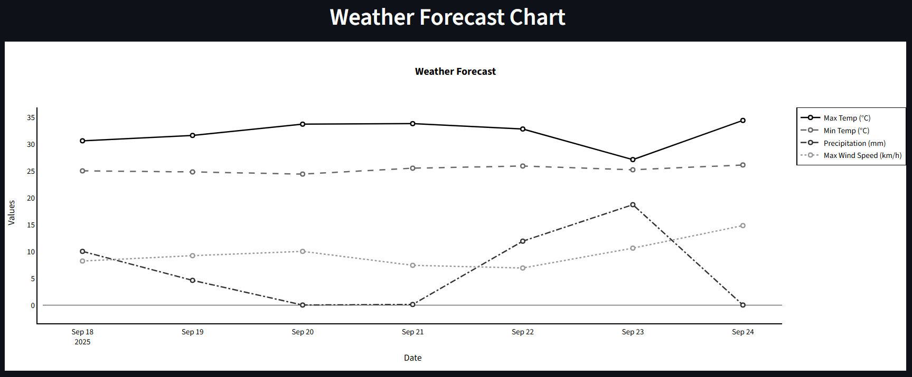

<p align="center">
  
</p>

<p align="center">
  
  
  
</p>

<p align="center">
  <a href="https://ady201m-group3.streamlit.app/">
    
  </a>
</p>

<p align="center">
  <a href="#feature">Features</a> •
  <a href="#how-to-run">How&nbsp;to&nbsp;Run</a> •
  <a href="#-project-structure">Project&nbsp;Structure</a> •
  <a href="#demo">Demo</a> •
  <a href="#techstack">Tech&nbsp;Stack</a> •
  <a href="#flow-app">Flow&nbsp;App</a> •
  <a href="#limitations">Limitations</a> •
  <a href="#authors">Authors</a>
  <a href="future-work">Future</a> •
</p>

EW: EasyWeather là một web app dự báo thời tiết 7 ngày sử dụng Open-Meteo API, thực hiện bởi nhóm 3 môn ADY201m do thầy Hùng-BK phụ trách.

## Features
- Tra cứu thời tiết sử dụng API thực của "Open-Meteo".
- Dự báo theo biểu đồ 7 ngày tới.
## How to run
```bash
git clone https://github.com/letrongv4ng/ady201m-group3
cd ady201m-group3
pip install -r requirements.txt
streamlit run app.py
```

 ## Project structure 
 ``` 
├── README.md
├── app.py
├── requirements.txt
└── assets/
    ├── logo.png
    └── chart.png

```

## Demo
[Truy cập app online](https://ady201m-group3.streamlit.app/) để xem live demo app.
Biểu đồ dự báo của Hà Nội 7 ngày tới:
<p align="center">
  
</p>

## Techstack:
- Python version: 3.10+
- Framework: streamlit
- Lib chính: requests, pandas, matplotlib.

## Flow app:

1. Người dùng nhập vào tên thành phố muốn tra cứu:
- Tự động gọi API Open-Meteo Geocoding để tìm toạ độ và tên thành phố chuẩn.
- Ghép tên thành phố vào "city-name" trong đường link dẫn đến API.
2. Dẫn API -> json raw
- Trích xuất dữ liệu từ json raw.
- Sử dụng plotly để tạo biểu đồ.
3. Kết quả:
- Ứng dụng hiển thị biểu đồ đường (line chart) thể hiện:
    - Nhiệt độ cao nhất
    - Nhiệt độ thấp 
    - Lượng mưa
    - Tốc độ gió

## Limitations
- Chưa hỗ trợ nhiều thành phố đồng thời / so sánh song song.

- Chưa hiển thị humidity; đang dùng: nhiệt độ max/min, mưa, gió.

- Chưa có i18n / chuyển đổi °C↔°F, mm↔inch.

- Chưa export PNG chart.

- Phụ thuộc Open-Meteo, tốc độ & giới hạn API theo mạng.

## Future work
1. Thêm dự báo dài hạn & nhiều model:
Hiện tại mới 7 ngày từ Open-Meteo. Có thể mở rộng sang 14–30 ngày, hoặc so sánh giữa nhiều forecast model.

2. Tích hợp phân tích thống kê:
Tính trung bình, phương sai, xu hướng (trendline).

3. So sánh nhiều thành phố cùng lúc
Input nhiều city -> vẽ chart overlay hoặc chart grid.

4. Ngôn ngữ & đơn vị tuỳ chọn
Hỗ trợ đa ngôn ngữ, chuyển đổi đơn vị.

## Authors:
- Lê Quang Hưng - MSSV: HE201273 - Leader.
    - Đảm nhiệm code logic chính là lên ý tưởng app flow.
- Đinh Quang Minh: MSSV: HE201506
    - Polish UI, phụ trách viết streamlit.
- Đỗ Mạnh Chung: MSSV: HE201350
    - Cung cấp API, quản lí đồng bộ code.